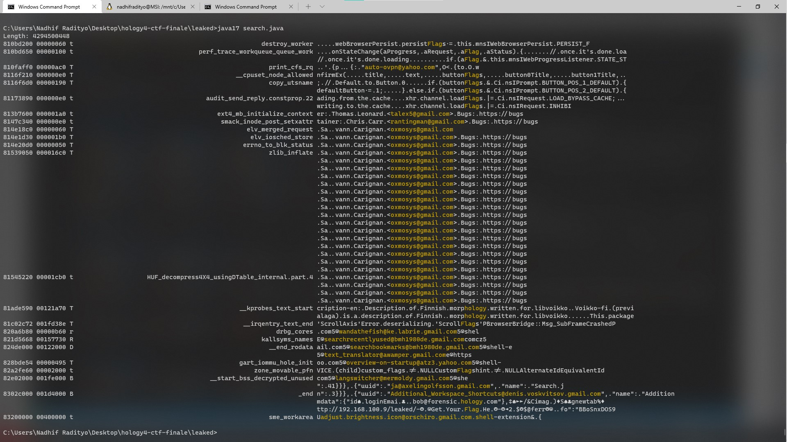

# Leaked

  
  


## Description
Core dump analysis. 

Don't worry, there are descriptions after the section `Attached files`, keep scrolling!

## Attached files
filter.java
```java
public static void main(String[] args) throws Exception {
    // https://en.wikipedia.org/wiki/System.map
    File functionHeadersFile = new File("boot/System.map-5.4.0-89-generic");
    String functionHeadersString = new String(Files.readAllBytes(functionHeadersFile.toPath()));
    Pattern pattern = Pattern.compile("^([a-zA-Z0-9]+)\\s*([a-zA-Z])\\s*([a-zA-Z0-9_\\.]+)$", Pattern.MULTILINE);
    Matcher matcher = pattern.matcher(functionHeadersString);

    File filteredFunctionsFile = new File("filtered");
    FileWriter writer = new FileWriter(filteredFunctionsFile);

    // int minLength = "email:password_toolsyangdipelajari_namafileyangdidownload_isifile".length();
    int minLength = 0;
    long lastAddress = 0;
    String lastType = null;
    String lastFunction = null;
    while(matcher.find()) {
        long address = Long.parseUnsignedLong(matcher.group(1), 16);
        String type = matcher.group(2);
        String function = matcher.group(3);

        long length = address - lastAddress;
        // "jangan abaikan proses"
        boolean adressIsUserSpace = true;
        boolean lastAdressIsUserSpace = true;
        // boolean adressIsUserSpace = Long.compareUnsigned(address, 0xffffffff00000000L) >= 0;
        // boolean lastAdressIsUserSpace = Long.compareUnsigned(lastAddress, 0xffffffff00000000L) >= 0;
        // boolean adressIsUserSpace = Long.compareUnsigned(address, 0xffffffff81000000L) >= 0;
        // boolean lastAdressIsUserSpace = Long.compareUnsigned(lastAddress, 0xffffffff81000000L) >= 0;
        // boolean adressIsUserSpace = Long.compareUnsigned(address, 0xffffffff82000000L) >= 0;
        // boolean lastAdressIsUserSpace = Long.compareUnsigned(lastAddress, 0xffffffff82000000L) >= 0;
        if(adressIsUserSpace && lastAdressIsUserSpace && length >= minLength) {
            String filtered = String.format("%016x %08x %s %s\n", lastAddress, length, lastType, lastFunction);
            System.out.print(filtered);
            writer.write(filtered);
            writer.flush();
        }

        lastAddress = address;
        lastType = type;
        lastFunction = function;
    }
    writer.close();
}
```
search.java
```java
public static void main(String[] args) throws Exception {
    File functionHeadersFile = new File("filtered");
    String functionHeadersString = new String(Files.readAllBytes(functionHeadersFile.toPath()));
    Pattern pattern = Pattern.compile("^([a-zA-Z0-9]+)\\s*([a-zA-Z0-9]+)\\s*([a-zA-Z])\\s*([a-zA-Z0-9_\\.]+)$", Pattern.MULTILINE);
    Matcher matcher = pattern.matcher(functionHeadersString);

    Pattern emailMatch = Pattern.compile("[A-Z0-9._%+-]+@[A-Z0-9.-]+\\.[A-Z]+", Pattern.CASE_INSENSITIVE);

    File glob = new File("memory.dmp");
    FileInputStream globFis = new FileInputStream(glob);
    byte[] temp = new byte[65536];
    List<String> views = new ArrayList<>(4);
    String emptyAlign = new String(new char[8 + 1 + 8 + 1 + 1 + 64 + 1 + 1]).replace("\0", " ");

    System.out.println("Length: " + glob.length());
    long lastAddress = 0;
    while(matcher.find()) {
        // ffffffff 81a49330
        long address = Long.parseLong(matcher.group(1).substring(8), 16);
        long length = Long.parseLong(matcher.group(2), 16);
        String type = matcher.group(3);
        String function = matcher.group(4);
        if(length > Integer.MAX_VALUE) {
            System.err.println("Length too large, function: " + function + ", length: " + length);
            continue;
        }

        long skip = address - lastAddress;
        globFis.skip(skip);
        lastAddress = address;
        // System.out.println("Skipping: " + skip);

        while(temp.length < length)
            temp = new byte[temp.length * 2];
        int read = globFis.read(temp, 0, (int) length);
        if(read != length) {
            System.err.println("Read length is not matching with targeted length, function: " + 
                    function + ", length: " + length + ", read: " + read);
        }

        String test = new String(temp, 0, read);
        Matcher emailMatcher = emailMatch.matcher(test);
        while(emailMatcher.find()) {
            String email = emailMatcher.group(0);
            if(!email.contains("gmail") && !email.contains("yahoo")) continue;
            // if(email.contains("ubuntu") || email.contains("debian") || email.contains("android"))
            //     continue;
            // if(email.contains("png") || email.contains("dev@") || email.contains("lists."))
            //     continue;
            view(test, email, 20, views);
        }
        // view(test, "txt", 40, views);
        // view(test, "user", 40, views);
        view(test, "hology", 40, views);
        // view(test, "password", 40, views);
        // view(test, "flag", 40, views);
        // view(test, "gmail", 40, views);
        view(test, "Flag", 40, views);
        if(views.size() == 0)
            continue;

        System.out.print(String.format("%08x %08x %s %64s %s\n", address, length, type, function, views.get(0)));
        for(int i = 1; i < views.size(); i++)
            System.out.println(emptyAlign + views.get(i));
        views.clear();
        // File out = new File(String.format("out/%08x_%s", address, function));
        // if(!out.exists() && !out.createNewFile())
        //     throw new Error("cannot write to file " + out.getPath());
        // try(FileOutputStream fos = new FileOutputStream(out)) {
        //     fos.write(temp, 0, read);
        //     fos.flush();
        // }
    }
}
public static void view(String test, String what, int range, List<String> views) {
    int firstAtChar = test.indexOf(what);
    while(firstAtChar != -1) {
        int beforeFirstAtChar = firstAtChar;
        int afterFirstAtChar = firstAtChar + what.length();
        int startView = Math.max(0, beforeFirstAtChar - range);
        int endView = Math.min(test.length(), afterFirstAtChar + range);
        String view = escapeNonAscii(test.substring(startView, beforeFirstAtChar)) + 
                ANSI_YELLOW + test.substring(beforeFirstAtChar, afterFirstAtChar) + ANSI_RESET +
                escapeNonAscii(test.substring(afterFirstAtChar, endView));
        views.add(view);
        firstAtChar = test.indexOf(what, firstAtChar + 1);
    }
}
public static String escapeNonAscii(String txt) {
    return txt.replaceAll("[^\\p{InBasic_Latin}]|[\\s\\033]", ".");
}
```
searchzip.java
```java
public static void main(String[] args) throws Exception {
    File glob = new File("memory.dmp");
    FileInputStream globFis = new FileInputStream(glob);

    byte[] temp = new byte[1048576];
    ByteArrayInputStream bais = new ByteArrayInputStream(temp);
    
    int read;
    long position = 0x6F353;
    globFis.skip(position);
    while((read = globFis.read(temp)) != -1) {
        int offset = searchZip(temp, read);
        if(offset == -1) {
            position += read;
            continue;
        }
        if(offset != 0) {
            int rewind = read - offset;
            System.out.println("Making the header at the start, at: " + (position + offset) + " rewinding: " + rewind);
            globFis.skip(-rewind);
            position += read - rewind;
            continue;
        }
        System.out.println("Detected zip at position: " + (position + offset));

        ZipInputStream zipis = new ZipInputStream(bais);
        ZipEntry zipEntry;
        try {
            while((zipEntry = zipis.getNextEntry()) != null) {
                File outFile = new File("outzip/" + zipEntry.getName());
                outFile.getParentFile().mkdirs();
                System.out.println(zipEntry.getName());
                extractZip(zipis, outFile);
                zipis.closeEntry();
            }
        } catch(Throwable e) {
            // e.printStackTrace();
        }

        int residue = bais.available();
        globFis.skip(-residue);
        position += read - residue;
        bais.reset();
    }
}
public static int searchZip(byte[] bytes, int length) throws IOException {
    int seq = 0;
    int i = 0;
    for(; i < length && seq != 4; i++) {
        if(seq == 0 && bytes[i] == (byte) 0x50) { seq++; continue; }
        if(seq == 1 && bytes[i] == (byte) 0x4b) { seq++; continue; }
        if(seq == 2 && bytes[i] == (byte) 0x03) { seq++; continue; }
        if(seq == 3 && bytes[i] == (byte) 0x04) { seq++; continue; }
        seq = 0;
    }

    if(seq == 0) return -1;
    return i - seq;
}
public static void extractZip(ZipInputStream zipis, File outFile) throws IOException {
    FileOutputStream fileOutputStream = new FileOutputStream(outFile);
    int len;
    byte[] content = new byte[1024];
    while((len = zipis.read(content)) > 0) {
        fileOutputStream.write(content, 0, len);
    }
    fileOutputStream.close();
}
```
searchgzip.java
```java
public static void main(String[] args) throws Exception {
    File glob = new File("memory.dmp");
    FileInputStream globFis = new FileInputStream(glob);

    byte[] temp = new byte[1048576];
    ByteArrayInputStream bais = new ByteArrayInputStream(temp);
    // byte[] temp2 = new byte[65535];
    int gzipLength = 1048576;
    int gzipCounter = 0;
    
    int read;
    long position = 0x6F353;
    globFis.skip(position);
    while((read = globFis.read(temp)) != -1) {
        int offset = searchGzip(temp, read);
        if(offset == -1) {
            position += read;
            continue;
        }
        if(offset != 0) {
            int rewind = read - offset;
            System.out.println("Making the header at the start, at: " + (position + offset) + " rewinding: " + rewind);
            globFis.skip(-rewind);
            position += read - rewind;
            continue;
        }
        System.out.println("Detected gzip at position: " + (position + offset));

        // GZIPInputStream gzipis = new GZIPInputStream(bais);
        // Inflater inf = getInflater(gzipis);
        // byte[] buf = getBuf(gzipis);
        // int len = getLen(gzipis);
        // CRC32 crc = getCrc(gzipis);
        // int i = 0;
        // for(; i < temp2.length; i++) {
        //     if(isValid(bais, inf, buf, len, crc))
        //         break;
        //     gzipis.read(temp2, i, 1);
        // }

        FileOutputStream fos = new FileOutputStream("outgzip/result" + (gzipCounter++));
        // fos.write(temp2, 0, i);
        fos.write(temp, 0, Math.min(read, gzipLength));
        fos.flush();
        fos.close();

        // int residue = bais.available();
        // globFis.skip(-residue);
        // position += read - residue;
        // bais.reset();
        int residue = read - gzipLength;
        globFis.skip(-residue);
        position += read - residue;
    }
}
public static int searchGzip(byte[] bytes, int length) throws IOException {
    int seq = 0;
    int i = 0;
    for(; i < length && seq != 3; i++) {
        if(seq == 0 && bytes[i] == (byte) 0x1f) { seq++; continue; }
        if(seq == 1 && bytes[i] == (byte) 0x8b) { seq++; continue; }
        if(seq == 2 && bytes[i] == (byte) 0x08) { seq++; continue; }
        seq = 0;
    }

    if(seq == 0) return -1;
    return i - seq;
}
```

## Summary
Given core dump file, which appeared to be unix platform. The task was to get some credentials. The hard part was analyzing it, because it was HUGE, and the fact that this was a real core dump from virtual machine (as later analyzed).


## Flag
```
We have no idea, we give up for now. If we come up with something, promise will solve this.
```

## Detailed solution

### **Basic plan and acknowledgement of what we already know**
Core dump is a dump of memory, usually made by the OS when system's crashed. It allows users to further debug and fix it. Basically, it's the same idea as program dump, but the difference is the context, whereas core dump is the whole memory of RAM, on the other hand, program dump is the block of memory that program is currently using.

With that information, we knew that core dump contained literally everything. Including how to get the flag. But it wasn't that easy, obviously.

**Disclaimer:** We might be wrong about given statement, feel free to discuss this further.

### **Section 1: Segmented search from block**
The task was to get some credentials, which were email, password, tools, file, and the contents of the file. So we had an idea, because email is known pattern, we could easily search for it.

With another help from segmented memory block (from given System.map), we could stripe out tiny blocks, becuse it wasn't possible to put string in it. With this help, the script can run very fast, because pathetic search with HxD hurts my computer. But the real deal was because so that we could implement our own logic.

```
0000000000000000 D __per_cpu_start
0000000000000000 D fixed_percpu_data
00000000000001e0 A kexec_control_code_size
0000000000001000 D cpu_debug_store
0000000000002000 D irq_stack_backing_store
0000000000006000 D cpu_tss_rw
0000000000009000 D gdt_page
...
ffffffff81000000 T _stext
ffffffff81000000 T _text
ffffffff81000000 T startup_64
ffffffff81000030 T secondary_startup_64
ffffffff810000e0 T verify_cpu
ffffffff810001e0 T start_cpu0
ffffffff810001f0 T __startup_64
...
ffffffff82000000 R __start_rodata
ffffffff820000a0 r __func__.65215
ffffffff820000c0 r __func__.65192
ffffffff820000e0 r __func__.65030
ffffffff820000f8 r __func__.5174
ffffffff82000100 r __func__.5164
...
ffffffff83000000 B __brk_base
ffffffff83000000 B __bss_stop
ffffffff83000000 B __end_bss_decrypted
ffffffff83000000 B __end_of_kernel_reserve
ffffffff83010000 b .brk.dmi_alloc
ffffffff83020000 b .brk.early_pgt_alloc
...
```
See the pattern above? It seems that the first 8 hex characters, and first second characters after it, look like a reserved address. e.g:
```
00000000 0002e000 D __per_cpu_end
00000000 01000000 A phys_startup_64

ffffffff 81 0001e0 T start_cpu0
ffffffff 81 0001f0 T __startup_64

ffffffff 82 0000f8 r __func__.5174
ffffffff 82 000100 r __func__.5164
```
The first 8 hex characters might not be real "memory" address. But instead, kind of like an identifier which register (or perhaps memory bank) that memory is contained at. At this point, it might already be on hardware level. Although this didn't really change much the search mechanism.

Usually the blocks with start address `00000000` is the system address, we tried to ignore it since there was nothing meaningful there.

The script for filtering tiny blocks is `filter.java` and for searching string within the filtered blocks is `search.java`


Example output of the program.

At near bottom line of above picture, we can see that there's `bob@forensic.hology.com`, and below that there's also `ttp://192.168.100.9/leaked/-☻.☺Get.Your.Flag.He.☻-`. It seems that the is text cutted off, but after tweaking the program again, and made further research, we come up with something:

- Contains `http://192.168.100.9/leaked/`
```java
mozLz40�±`��ð{"version":["ses�ò
restore",1],"windows":[{"tab	�bentrie�òurl":"about:welcome","title":"W�ð& to Firefox","cacheKey":0,"ID":4054048920,"docshellUU�ô6"{fffd6a1b-0de0-481d-9b89-e16ca688424b}","resultPrincipalURI":null,"p�õrToInherit_base64":"eyIwIjp7IjAiOiJtb3otbnVsbHByaW5jaXBhbDp7YWQzNmYzZTgtODE5OC00MjdiLTgxYWMtOTlhZjQ4ZjI4NjFjfSJ9fQ==","partitionedž�Š�cñ�hasUserInteractöõfalse,"triggeringB	%z%0fX0Ñ�ôdocIdentifier":8589934593,"persist":true},÷
http://192.168.100.9/leaked/-ðGet Your Flag He„-2‚�$$@ferröfo":"BBoSnxDOS9qmDeAnom1e0A�w�#EY
�"EB	�³EA","originkä�	ž3�	�²loadReplaceQ	�2�pU1ÿ=mFmMTFiNDQtNjRjNy00YTA2LWFlMWMtMWE0ZTU2NzZkNDNhfT9odHRwOi8vMTkyLjE2OC4xMDAuOûG¦�C�À34ö],"lastAccessed":1636141679587,"hiddeš¤searchModeÐÑuserContextIdD€attribut“‘{},"index*¢requestedI�0?�çTypedValue":""�QClear'�àformdata":{"id�loginEmaiñóbob@forensic.hology.com"},/&�CimagÓ��)Sgnewtab%QNew T�G_11334G�ÿa8655bab-4543-427e-9c20-ee33457afadcG'>/¼10737418241)	?às://www.googlek/ð?channel=fs&client=ubuntu&q=exiftool+linuz—� �ñ - Penelusuran Gc�{X{K 3EKô!OWI1MjI2ODAtODMzMi00ZThjLTg0NTktMTlhMDEyNWQ3ZDI3fÿ
czovL3d3dy5nb29nbGUuY29tIn19a?¦�D?M°2,"structurÇÒoneState":"Agµ18f8	�ñCAD//wUAAIAEAP//c3RhdGU��� �M �BdXJs� Ax>�B@�ó2y9zZWFyY2g/Y2hhbm5lb

```

- Request to `http://192.168.100.9/leaked/`
```http
partitionKey=%28http%2C192.168.100.9%29,:http://192.168.100.9/leaked/�necko:classified�1�strongly-framed�1�request-method�GET�request-Accept-Encoding�gzip, deflate�response-head�HTTP/1.1 200 OK
Date: Fri, 05 Nov 2021 19:47:01 GMT
Server: Apache/2.4.51 (Debian)
Last-Modified: Fri, 05 Nov 2021 09:46:09 GMT
ETag: "2b1-5d00783434e7a-gzip"
Accept-Ranges: bytes
Vary: Accept-Encoding
Content-Encoding: gzip
Content-Length: 371
Content-Type: text/html
�original-response-headers�Date: Fri, 05 Nov 2021 19:47:01 GMT
Server: Apache/2.4.51 (Debian)
Last-Modified: Fri, 05 Nov 2021 09:46:09 GMT
ETag: "2b1-5d00783434e7a-gzip"
Accept-Ranges: bytes
Vary: Accept-Encoding
Content-Encoding: gzip
Content-Length: 371
Keep-Alive: timeout=5, max=99
Connection: Keep-Alive
Content-Type: text/html
�ctid�1�net-response-time-onstart�37�net-response-time-onstop�195���s
```

- Somehow related `http://192.168.100.9/leaked/getFlag.php` and `file:///home/void/Downloads/secret.zip`

- Spotted values, already summarized
```
http://192.168.100.9/leaked/
email: bob@forensic.hology.com
tools: exiftool
username: MEIEEPgAAAAAAAAAAAAAAAAAAAEwFAYIKoZIhvcNAwcECGOMfRgHBFxcBBjD26R9AXhOwlp/CcYmJI9s/Q4QEJ1DFyg=
password: MEIEEPgAAAAAAAAAAAAAAAAAAAEwFAYIKoZIhvcNAwcECGpuv1F/yJz4BBj735iDOB0IQx08xCNQSG8kFOJRed8yV7o=
```

### **Section 2: Segmented search from block**
With another clue from spotted `secret.zip`, our next move was to find and get it. We had an idea, because of any file read/write usually copied to RAM first, there was a chance that the contents were still in the dump. Another thing was, any call to memory free usually only mark that part of memory to be free, not emptied.

The next hard thing was actually how to find that block of memory? So because of the file extension, and some pointed by the request header before, the file was actually a zip or gzip file.

Like any other open standard extensions, zip and gzip has some magic constant at the start of their file. Which is `50 4B 03 04` for zip and `1F 8B [08]` for gzip. 

So we wrote scripts to lookup for those patterns and tried to extract it. For gzip we only extracted a constant length part of it, because there's no size information on gzip.

`searchzip.java` extracts zips from dump file, and `searchgzip.java` extracts gzips from dump file.

We successfully extracted files from any zip files contained in dump. But gzip is was just tedious. In extracted zip files there was no such file named `secret.zip` and there was no meaningful files either.

## Another ideas
Another participants on discord said, there's a tool for analyzing dump file (of course we google'd if there was a dump analyzer before making any of these scripts), but they couldn't get the tool running. I don't know why. 

We forgot time, and apparently the CTF had ended before we answered any of the challenges, lol. Such a fun journey though!
